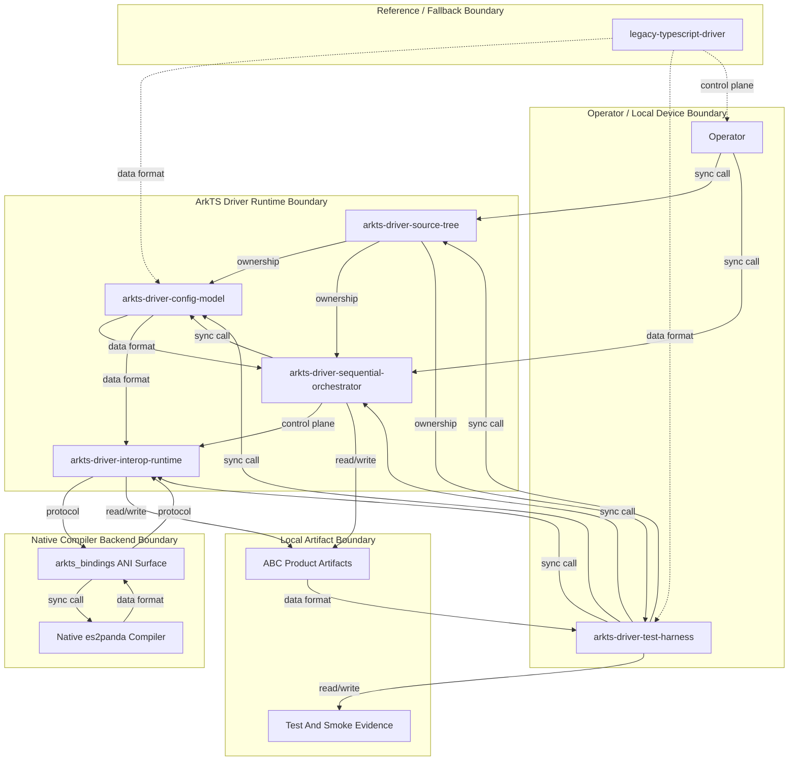

# Design Package Architecture

This file is copied from the approved Triborg design package during implementator preflight.

# Architecture

## Need
This architecture ports the ArkTS frontend compiler build-system driver from a Node.js subprocess orchestrator to an ArkTS in-process driver that uses the existing `arkts_bindings` ANI surface as the compiler backend. The first version is intentionally narrow: it preserves the TypeScript driver, introduces a parallel ArkTS source tree, supports sequential `demo_hap` module compilation, and validates parity through compiler/runtime smoke tests. Control flow moves from `child_process` execution to direct native calls, while file artifacts remain the visible product output.

- Provide an ArkTS build-system driver source tree under `driver/build_system/ets_src/` that compiles as an ArkTS module.
- Preserve the existing TypeScript build system as the reference and fallback path.
- Replace `es2panda` subprocess invocation in the ArkTS driver with in-process ANI calls through `arkts_bindings`.
- Support sequential per-module compilation for `test/demo_hap/` including `harB`, `harA`, and entry sources.
- Produce `.abc` artifacts equivalent in role and dependency order to the TypeScript driver output.
- Add ArkTS-compatible test drivers for config processing, graph ordering, native single-file compilation, and sequential orchestration.

- Parallel, worker, process-pool, or thread-pool compilation — excluded from first iteration to keep orchestration deterministic and small.
- Obfuscation integration — excluded because the acceptance path targets plain sequential `demo_hap` compilation.
- External project building — excluded from first iteration.
- DeclgenV1 and declaration-generation support — excluded unless already required by language-version compatibility.
- Replacing or deleting the TypeScript driver — excluded because the TypeScript implementation remains the reference path.
- Calling Node.js APIs from ArkTS — excluded by request constraints.
- Introducing a new workflow engine or build scheduler — excluded because sequential dependency traversal is sufficient for the requested smoke target.

## Approach
### Overview
The port is structured as a parallel ArkTS driver subsystem beside the existing TypeScript driver. `driver/build_system/src/` remains intact and continues to serve as the behavioral reference, while `driver/build_system/ets_src/` owns the new ArkTS runtime path. This follows the request constraint to preserve the TypeScript driver and the competitor/reference pattern of keeping migration paths independently verifiable before decommissioning old invocation behavior (`typescript`, `arkts_mvp`, spec: Formalized Request Tasks 1–11).

The architecture has six stable subsystems:

1. `arkts-driver-source-tree` owns the ArkTS module scaffold, import layout, `arktsconfig.json`, and source organization mirroring the TypeScript build-system layout. It is responsible for parse/import compatibility and not for runtime compilation behavior.
2. `arkts-driver-config-model` owns ArkTS equivalents of build-system constants, enums, config records, resolved module metadata, and ArkTS config generation. It treats TypeScript source files as the reference contract and produces ArkTS-native data structures suitable for the native compiler backend.
3. `arkts-driver-interop-runtime` owns all runtime contact with `arkts_bindings`, including file existence/read helpers, native library path resolution, environment variable substitution, memory lifecycle assumptions, and `es2panda` config/context/state calls.
4. `arkts-driver-sequential-orchestrator` owns the top-level build lifecycle: read build config, resolve modules, order dependencies, compile modules in topological order, and emit `.abc` artifacts for the demo target.
5. `arkts-driver-test-harness` owns standalone `.ets` validation drivers and the command-level smoke surface under `driver/build_system/test/ets_ut/`.
6. `legacy-typescript-driver` remains the reference implementation and compatibility fallback, but is not imported by the ArkTS driver.

The core invariant is that Temporal-like orchestration state is not introduced: the ArkTS driver is a local compiler driver, and the only durable product artifacts are `.abc` outputs and optional test evidence. The in-process compiler state is owned by `arkts-driver-interop-runtime`; generated config and resolved module metadata are owned by `arkts-driver-config-model`; dependency and compilation order are owned by `arkts-driver-sequential-orchestrator`.

The control flow is:

1. Operator compiles the ArkTS build-system source tree with `es2panda --ets-module --arktsconfig driver/build_system/arktsconfig.json`.
2. Operator runs the resulting driver ABC with the `demo_hap` `build_config.json` path.
3. The entry surface loads and validates the raw config.
4. Config processing resolves SDK paths, dependency module paths, alias/config options, and native library path assumptions.
5. The dependency graph is ordered for sequential compilation.
6. Each module receives an ArkTS config object/string compatible with the native compiler backend.
7. The native backend creates compiler config/context objects, advances compilation states through code generation, reports errors through typed driver failures, and releases native resources.
8. The output surface contains non-empty `.abc` artifacts for `harB`, `harA`, and entry module sources.
9. Tests and smoke commands compare structure, ordering, and import resolution against the TypeScript reference path.

This resolves the decomposed tasks without prescribing component-internal algorithms: the architecture defines ownership, data/control boundaries, validation surfaces, and decommission behavior only.

### Architecture Diagram

### Components
- `arkts-driver-source-tree` — ArkTS source scaffold, module layout, logger/entry placement, and build-system `arktsconfig.json` surface
- `arkts-driver-config-model` — ArkTS schemas for build config, dependency modules, constants, generated compiler config, and config-reference parity
- `arkts-driver-interop-runtime` — Native binding integration for file helpers, environment/native-library helpers, and es2panda compiler lifecycle
- `arkts-driver-sequential-orchestrator` — Sequential module dependency ordering, compile lifecycle coordination, output validation, and unsupported-mode policy
- `arkts-driver-test-harness` — Standalone `.ets` tests and product smoke evidence for compile/runtime behavior
- `legacy-typescript-driver` — Existing TypeScript driver preserved as behavioral reference and fallback path

### Requirement Coverage
| Request Task | Architecture Resolution | Components | Interfaces / Flow | Risk | Validation |
|---|---|---|---|---|---|
| Task 1 | Introduce a parallel ArkTS source tree and build-system ArkTS config mirroring the TypeScript layout. | `arkts-driver-source-tree` | `ets_src/` imports `@arkts-bindings`; `arktsconfig.json` drives `es2panda`. | Import resolution mismatch. | Operator compiles build-system ABC with `es2panda` and observes exit 0. |
| Task 2 | Define ArkTS config/types/constants equivalent to the TypeScript driver contract. | `arkts-driver-config-model` | Test driver imports type/config surfaces and constructs sample config. | ArkTS type restrictions differ from TypeScript interfaces. | Runtime test prints expected `packageName`. |
| Task 3 | Provide ArkTS logger surface with console output and exception-based fatal handling. | `arkts-driver-source-tree` | Logger calls flow to ArkTS `console.*`; fatal path throws. | Runtime console behavior differs. | Runtime test prints `build started`. |
| Task 4 | Provide ArkTS utility surfaces for graph ordering, errors, path/string helpers, file existence, and env substitution. | `arkts-driver-config-model`, `arkts-driver-interop-runtime` | Graph utility orders modules; file helpers use binding surface. | Path behavior may diverge from Node.js. | Runtime graph test prints dependency-correct order. |
| Task 5 | Generate ArkTS compiler config as an in-memory object/string compatible with native compiler config creation. | `arkts-driver-config-model`, `arkts-driver-interop-runtime` | Build config input flows to `ArkTSConfigSchema`, then native config request. | Generated config may differ from TypeScript reference. | Golden comparison against TypeScript generator output. |
| Task 6 | Resolve raw build config into absolute module/SDK/native-library paths using ArkTS and binding helpers. | `arkts-driver-config-model`, `arkts-driver-interop-runtime` | Raw JSON -> resolved `BuildConfigSchema`. | SDK/native paths may be runtime-specific. | Test ABC outputs resolved paths matching TypeScript reference. |
| Task 7 | Replace subprocess compilation in the ArkTS path with native compiler lifecycle calls. | `arkts-driver-interop-runtime` | Config/context/state/destroy native lifecycle emits `.abc`. | Native API may not cover required codegen flow. | Single-file `harB/index.ets` compile creates non-empty `.abc`. |
| Task 8 | Own sequential dependency-ordered module orchestration in ArkTS. | `arkts-driver-sequential-orchestrator` | Resolved config -> graph order -> native compile per module/source -> dist outputs. | Module merge/output semantics may differ from TypeScript driver. | Demo run produces non-empty `harB`, `harA`, and entry ABC outputs. |
| Task 9 | Provide ArkTS entry/build-mode surface that reads config, initializes build state, runs sequential mode, and logs failures. | `arkts-driver-sequential-orchestrator`, `arkts-driver-source-tree` | Runtime argument -> config processing -> build run -> output artifacts. | Runtime argument access may be platform-specific. | Compiled driver ABC exits 0 on demo config with outputs present. |
| Task 10 | Define end-to-end smoke validation comparing generated ABC structure/imports to TypeScript reference. | `arkts-driver-test-harness`, `legacy-typescript-driver` | ArkTS driver output -> dump/disasm inspection -> reference comparison. | Dump tooling availability may vary. | Inspection shows `strA` and `strB` resolution consistent with source/reference. |
| Task 11 | Add standalone ArkTS test-driver layout for config, graph, native compile, and orchestration validation. | `arkts-driver-test-harness` | `test/ets_ut/` files compile/run independently. | Tests may become environment-sensitive. | Script compiles/runs each test ABC with exit 0. |

### Risks And Validation
- Native binding lifecycle may not fully support the requested codegen/output flow — mitigation: validate with single-file compile before orchestration smoke — severity: high
- ArkTS language constraints may reject TypeScript-like interface patterns — mitigation: keep config/type schemas simple and validate with import/runtime tests — severity: medium
- Path handling may diverge from Node.js behavior — mitigation: compare resolved paths against TypeScript reference output — severity: medium
- Module-level ABC merge semantics may differ from the TypeScript driver — mitigation: validate required demo artifacts and inspect cross-module imports — severity: high
- Runtime argument and library loading behavior may be environment-specific — mitigation: document runtime command assumptions and reject missing native library deterministically — severity: medium
- Tests may depend on local PANDA tool availability — mitigation: keep product validation commands explicit and evidence-based — severity: medium

- Build-system source compile — trigger: operator runs `es2panda --ets-module --arktsconfig driver/build_system/arktsconfig.json --output driver/build_system/dist/build_system.abc driver/build_system/ets_src/entry.ets`; product surface: ArkTS driver module; expected outcome: compiler exits 0 with no diagnostics; proves scaffold/import compatibility.
- Types/config runtime test — trigger: compiled test imports config schemas and prints `packageName`; product surface: config model; expected outcome: expected string on stdout; proves ArkTS schema usability.
- Logger runtime test — trigger: compiled test calls logger info output; product surface: logger; expected outcome: `build started` on stdout; proves runtime logging.
- Graph runtime test — trigger: compiled test creates two-node dependency graph; product surface: graph utility; expected outcome: dependency-correct order; proves sequential scheduling input.
- ArkTS config golden comparison — trigger: compiled test generates config from demo build config; product surface: compiler config generation; expected outcome: `compilerOptions`, `files`, and `paths` match TypeScript reference snapshot; proves config parity.
- Build-config resolution test — trigger: compiled test initializes demo config; product surface: config initialization; expected outcome: resolved SDK/module paths match TypeScript reference output; proves config compatibility.
- Native single-file compile — trigger: compiled test compiles `harB/index.ets`; product surface: native compiler integration; expected outcome: non-empty `.abc`; proves subprocess replacement.
- Sequential demo compile — trigger: operator runs compiled ArkTS driver with demo build config; product surface: build-system driver runtime; expected outcome: non-empty `harB`, `harA`, and entry ABC artifacts; proves module orchestration.
- Cross-module import smoke — trigger: operator inspects entry ABC with dump/disasm tooling; product surface: final ABC artifact; expected outcome: `strA` and `strB` references visible/consistent with source and TypeScript baseline; proves dependency resolution.
- Test harness run — trigger: script compiles and runs all `test/ets_ut/` test drivers; product surface: ArkTS test suite; expected outcome: all exit 0; proves regression coverage.

## Benefits
- Removes Node.js subprocess overhead from the ArkTS driver path for the targeted compile flow.
- Keeps migration risk low by preserving the TypeScript driver unchanged.
- Makes compiler invocation more direct and testable through stable native binding lifecycle contracts.
- Provides product-visible acceptance through `.abc` artifacts, not only source-level checks.
- Establishes a small ArkTS-first scaffold that can later expand to parallelism, obfuscation, and declaration generation.

## Competition / Alternatives
- `typescript` - The existing TypeScript driver is the direct behavioral reference and already proves the intended module/config flow. The ArkTS approach is superior for the requested migration because it removes Node.js subprocess dependence while preserving reference parity.
- `kotlin` - Kotlin-style compiler frontends commonly separate configuration, module graph, and compiler invocation concerns. This architecture adopts that separation at subsystem level without adding extra runtime complexity.
- `tscgo` - A native/compiled driver path demonstrates the benefit of avoiding script-runtime overhead for compiler orchestration. The ArkTS design applies that benefit while staying inside the ArkTS/PANDA ecosystem.
- `arkts_mvp` - The MVP reference supports a narrow first usable path before expanding features. This architecture follows that approach by accepting only sequential `demo_hap` compilation first.
